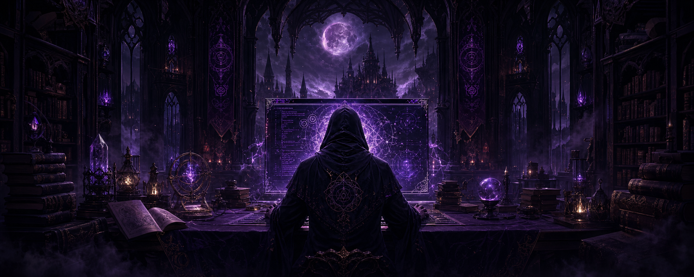

<h1 align="center">♱ Hassrol ♱</h1>

  <em>Entre lignes de code et arcanes numériques.</em>

  
  
  

---

## ☾ Le grimoire

Développeur passionné, je façonne des projets dans les profondeurs du Web.
Chaque nouveau langage est une rune à maîtriser, chaque bug une créature à
vaincre.

- ⚔️ Je forge actuellement **mon prochain projet**
- 🜏 J'explore de nouvelles technologies et perfectionne mon art
- 🕯️ J'aime résoudre des énigmes et donner vie à des idées
- 🦇 Je suis ouvert aux collaborations et aux quêtes intéressantes
- ✉️ Un message peut m'être envoyé à **ya.hassrol@gmail.com**

## ⚜️ Arsenal technologique

  
  
  
  
  
  
  

## 🗝️ Quêtes accomplies

| Projet | Chronique |
| :--- | :--- |
| [⚡ Energy](https://github.com/FireDroX/energy) | Une création autour de l'énergie |
| [♟️ PLAKOTO](https://github.com/XeTr0S/PLAKOTO) | Une adaptation numérique du jeu Plakoto |
| [🔥 Hu Tao Discord Bot](https://github.com/XeTr0S/HU_TAO_DISCORD_BOT) | Un bot Discord inspiré par Hu Tao |

## 🔮 Échos de GitHub

  
  

  

## 🕸️ Portails

  
  
  

---

  <em>« Dans l'ombre du code, chaque erreur révèle un nouveau chemin. »</em>

