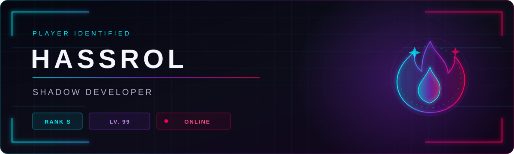
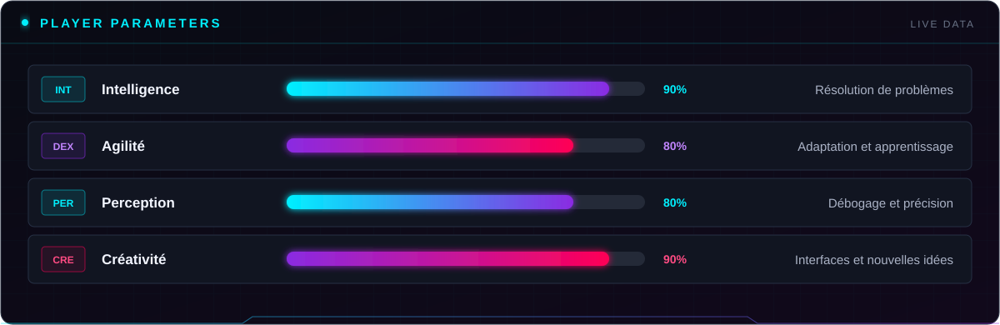

<div align="center">
  
</div>

<br>

```text
[ SYSTEM ]  Synchronisation terminée.
            Bienvenue dans l'interface du joueur XeTr0S.
```

## `01 >> PROFIL`

<table>
  <tr>
    <td><strong>IDENTITÉ</strong></td>
    <td>Hassrol</td>
    <td><strong>CLASSE</strong></td>
    <td>Développeur</td>
  </tr>
  <tr>
    <td><strong>ALIAS</strong></td>
    <td>XeTr0S</td>
    <td><strong>SPÉCIALITÉ</strong></td>
    <td>Web & programmation</td>
  </tr>
  <tr>
    <td><strong>RANG</strong></td>
    <td><code>S</code></td>
    <td><strong>STATUT</strong></td>
    <td>🟣 Disponible</td>
  </tr>
</table>

> Développeur passionné, je transforme des idées en expériences numériques et
> j'améliore continuellement mon arsenal technique.


## `02 >> ATTRIBUTS`

<div align="center">
  
</div>

### Arsenal technique

<div align="center">


</div>


## `03 >> REGISTRE DES QUÊTES`

<table>
  <tr>
    <th>RANG</th>
    <th>QUÊTE</th>
    <th>OBJECTIF</th>
    <th>ÉTAT</th>
  </tr>
  <tr>
    <td><code>A</code></td>
    <td><a href="https://github.com/FireDroX/energy"><strong>Energy</strong></a></td>
    <td>Projet autour de l'énergie</td>
    <td>✅ TERMINÉE</td>
  </tr>
  <tr>
    <td><code>A</code></td>
    <td><a href="https://github.com/XeTr0S/PLAKOTO"><strong>PLAKOTO</strong></a></td>
    <td>Adaptation numérique du Plakoto</td>
    <td>✅ TERMINÉE</td>
  </tr>
  <tr>
    <td><code>S</code></td>
    <td><a href="https://github.com/XeTr0S/HU_TAO_DISCORD_BOT"><strong>Hu Tao Bot</strong></a></td>
    <td>Développer un bot Discord</td>
    <td>✅ TERMINÉE</td>
  </tr>
  <tr>
    <td><code>?</code></td>
    <td><strong>Prochaine invocation</strong></td>
    <td>Objectif classifié</td>
    <td>◉ EN COURS</td>
  </tr>
</table>


## `04 >> ANALYSE DU JOUEUR`

<div align="center">
  
  
  <br>
  
</div>


## `05 >> CANAUX OUVERTS`

<div align="center">

[](https://www.linkedin.com/in/hassrol-ya-9357a936b/)
[](https://ko-fi.com/seoo)
[](mailto:ya.hassrol@gmail.com)


<br>

```text
SYSTEM MESSAGE
Your limits exist only to be surpassed.

  A R I S E
```

</div>
