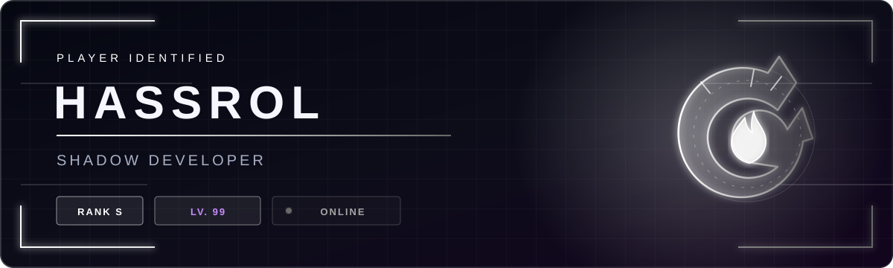
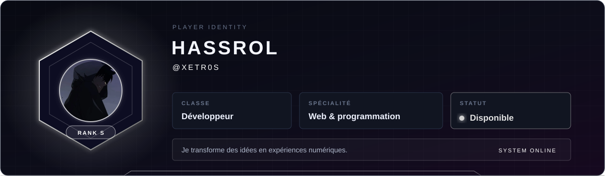
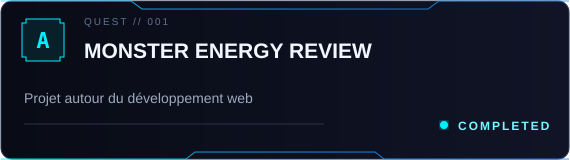
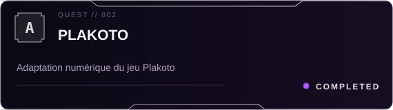
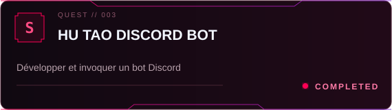
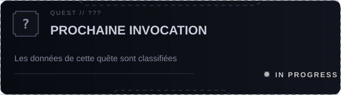

<div align="center">
  
</div>

<br>

```text
[ SYSTEM ]  Synchronisation terminée.
            Bienvenue dans l'interface du joueur XeTr0S.
```

## `01 >> PROFIL`

<div align="center">
  
</div>


## `02 >> ATTRIBUTS`

<div align="center">
  
</div>

### Arsenal technique

<div align="center">


</div>


## `03 >> REGISTRE DES QUÊTES`

<div align="center">
  <a href="https://github.com/FireDroX/energy">
    
  </a>
  <a href="https://github.com/XeTr0S/PLAKOTO">
    
  </a>
  <a href="https://github.com/XeTr0S/HU_TAO_DISCORD_BOT">
    
  </a>
  
</div>


## `04 >> ANALYSE DU JOUEUR`

<div align="center">
  
  
  <br>
  
</div>


## `05 >> CANAUX OUVERTS`

<div align="center">

[](https://www.linkedin.com/in/hassrol-ya-9357a936b/)
[](https://ko-fi.com/seoo)
[](mailto:ya.hassrol@gmail.com)


<br>


</div>
